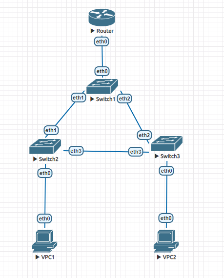

# Реализация небольшой сети офиса



### Router
```
 interfaces {
     ethernet eth0 {
         hw-id 50:00:00:01:00:00
         vif 10 {
             address 10.0.10.5/24
         }
         vif 20 {
             address 10.0.20.5/24
         }
     }
     ethernet eth1 {
         hw-id 50:00:00:01:00:01
     }
     ethernet eth2 {
         hw-id 50:00:00:01:00:02
     }
     ethernet eth3 {
         hw-id 50:00:00:01:00:03
     }
     loopback lo {
     }
 }
 system {
     config-management {
         commit-revisions 100
     }
     conntrack {
         modules {
             ftp
             h323
             nfs
             pptp
             sip
             sqlnet
             tftp
         }
     }
     console {
         device ttyS0 {
             speed 115200
         }
     }
     host-name vyos
     login {
         user vyos {
             authentication {
                 encrypted-password $6$Geh/wadCOu4LCvAT$diIPyzS8J.BgNQN2.eW9JT42.7XVrugXPSETt7n7M0BJLrPsRRkxKfmbSxSk9lNiln3FULVrlneb5n6YSbg9R/
                 plaintext-password ""
             }
         }
     }
     ntp {
         server time1.vyos.net {
         }
         server time2.vyos.net {
         }
         server time3.vyos.net {
         }
     }
     syslog {
         global {
             facility all {
                 level info
             }
             facility protocols {
                 level debug
             }
         }
     }
 }
```

### Switch1
```
 interfaces {
     bridge br0 {
         enable-vlan
         member {
             interface eth0 {
                 allowed-vlan 10
                 allowed-vlan 20
             }
             interface eth1 {
                 allowed-vlan 20
                 allowed-vlan 10
             }
             interface eth2 {
                 allowed-vlan 10
                 allowed-vlan 20
             }
         }
         priority 1
         stp
     }
     ethernet eth0 {
         hw-id 50:00:00:02:00:00
     }
     ethernet eth1 {
         hw-id 50:00:00:02:00:01
     }
     ethernet eth2 {
         hw-id 50:00:00:02:00:02
     }
     ethernet eth3 {
         hw-id 50:00:00:02:00:03
     }
     loopback lo {
     }
 }
 system {
     config-management {
         commit-revisions 100
     }
     conntrack {
         modules {
             ftp
             h323
             nfs
             pptp
             sip
             sqlnet
             tftp
         }
     }
     console {
         device ttyS0 {
             speed 115200
         }
     }
     host-name vyos
     login {
         user vyos {
             authentication {
                 encrypted-password $6$Geh/wadCOu4LCvAT$diIPyzS8J.BgNQN2.eW9JT42.7XVrugXPSETt7n7M0BJLrPsRRkxKfmbSxSk9lNiln3FULVrlneb5n6YSbg9R/
                 plaintext-password ""
             }
         }
     }
     ntp {
         server time1.vyos.net {
         }
         server time2.vyos.net {
         }
         server time3.vyos.net {
         }
     }
     syslog {
         global {
             facility all {
                 level info
             }
             facility protocols {
                 level debug
             }
         }
     }
 }
```

### Switch2

```
 interfaces {
     bridge br0 {
         enable-vlan
         member {
             interface eth0 {
                 native-vlan 10
             }
             interface eth1 {
                 allowed-vlan 10
                 allowed-vlan 20
             }
             interface eth3 {
                 allowed-vlan 10
                 allowed-vlan 20
             }
         }
         priority 2
         stp
     }
     ethernet eth0 {
         hw-id 50:00:00:03:00:00
     }
     ethernet eth1 {
         hw-id 50:00:00:03:00:01
     }
     ethernet eth2 {
         hw-id 50:00:00:03:00:02
     }
     ethernet eth3 {
         hw-id 50:00:00:03:00:03
     }
     loopback lo {
     }
 }
 system {
     config-management {
         commit-revisions 100
     }
     conntrack {
         modules {
             ftp
             h323
             nfs
             pptp
             sip
             sqlnet
             tftp
         }
     }
     console {
         device ttyS0 {
             speed 115200
         }
     }
     host-name vyos
     login {
         user vyos {
             authentication {
                 encrypted-password $6$Geh/wadCOu4LCvAT$diIPyzS8J.BgNQN2.eW9JT42.7XVrugXPSETt7n7M0BJLrPsRRkxKfmbSxSk9lNiln3FULVrlneb5n6YSbg9R/
                 plaintext-password ""
             }
         }
     }
     ntp {
         server time1.vyos.net {
         }
         server time2.vyos.net {
         }
         server time3.vyos.net {
         }
     }
     syslog {
         global {
             facility all {
                 level info
             }
             facility protocols {
                 level debug
             }
         }
     }
 }
```

### Switch3

```
 interfaces {
     bridge br0 {
         enable-vlan
         member {
             interface eth0 {
                 native-vlan 20
             }
             interface eth2 {
                 allowed-vlan 10
                 allowed-vlan 20
             }
             interface eth3 {
                 allowed-vlan 10
                 allowed-vlan 20
             }
         }
         priority 2
         stp
     }
     ethernet eth0 {
         hw-id 50:00:00:04:00:00
     }
     ethernet eth1 {
         hw-id 50:00:00:04:00:01
     }
     ethernet eth2 {
         hw-id 50:00:00:04:00:02
     }
     ethernet eth3 {
         hw-id 50:00:00:04:00:03
     }
     loopback lo {
     }
 }
 system {
     config-management {
         commit-revisions 100
     }
     conntrack {
         modules {
             ftp
             h323
             nfs
             pptp
             sip
             sqlnet
             tftp
         }
     }
     console {
         device ttyS0 {
             speed 115200
         }
     }
     host-name vyos
     login {
         user vyos {
             authentication {
                 encrypted-password $6$Geh/wadCOu4LCvAT$diIPyzS8J.BgNQN2.eW9JT42.7XVrugXPSETt7n7M0BJLrPsRRkxKfmbSxSk9lNiln3FULVrlneb5n6YSbg9R/
                 plaintext-password ""
             }
         }
     }
     ntp {
         server time1.vyos.net {
         }
         server time2.vyos.net {
         }
         server time3.vyos.net {
         }
     }
     syslog {
         global {
             facility all {
                 level info
             }
             facility protocols {
                 level debug
             }
         }
     }
 }
```

### VPC1
```
NAME        : VPCS[1]
IP/MASK     : 10.0.10.1/24
GATEWAY     : 10.0.10.5
DNS         :
MAC         : 00:50:79:66:68:05
LPORT       : 20000
RHOST:PORT  : 127.0.0.1:30000
MTU         : 1500
```

### VPC2
```
NAME        : VPCS[1]
IP/MASK     : 10.0.20.1/24
GATEWAY     : 10.0.20.5
DNS         :
MAC         : 00:50:79:66:68:06
LPORT       : 20000
RHOST:PORT  : 127.0.0.1:30000
MTU         : 1500
```

### VPC1 -> VPC2
```
VPCS> ping 10.0.20.1

84 bytes from 10.0.20.1 icmp_seq=1 ttl=63 time=7.969 ms
84 bytes from 10.0.20.1 icmp_seq=2 ttl=63 time=17.271 ms
84 bytes from 10.0.20.1 icmp_seq=3 ttl=63 time=5.016 ms
84 bytes from 10.0.20.1 icmp_seq=4 ttl=63 time=3.720 ms
84 bytes from 10.0.20.1 icmp_seq=5 ttl=63 time=6.429 ms
```

### VPC2 -> VPC1
```
VPCS>  ping 10.0.10.1

84 bytes from 10.0.10.1 icmp_seq=1 ttl=63 time=14.736 ms
84 bytes from 10.0.10.1 icmp_seq=2 ttl=63 time=39.680 ms
84 bytes from 10.0.10.1 icmp_seq=3 ttl=63 time=4.922 ms
84 bytes from 10.0.10.1 icmp_seq=4 ttl=63 time=18.505 ms
84 bytes from 10.0.10.1 icmp_seq=5 ttl=63 time=29.200 ms
```

В конфигурациях маршрутизаторов можно заметить, что приоритет 1-го имеет значение
меньше, чем у 2 и 3 => при работающей между свичами 3 и 1, запрос из 3 пойдет
именно в 1, а не в 3. Аналогично для маршрутизатора номер 2.

```
br0
 bridge id              0002.500000040000
 designated root        0001.500000020000
 root port                 2                    path cost                100
 max age                  20.00                 bridge max age            20.00
 hello time                2.00                 bridge hello time          2.00
 forward delay            14.00                 bridge forward delay      14.00
 ageing time             300.00
 hello timer               0.00                 tcn timer                  0.00
 topology change timer     0.00                 gc timer                  25.71
 flags

eth0 (1)
 port id                8001                    state                forwarding
 designated root        0001.500000020000       path cost                100
 designated bridge      0002.500000040000       message age timer          0.00
 designated port        8001                    forward delay timer        0.00
 designated cost         100                    hold timer                 0.00
 flags

eth2 (2)
 port id                8002                    state                forwarding
 designated root        0001.500000020000       path cost                100
 designated bridge      0001.500000020000       message age timer         18.60
 designated port        8003                    forward delay timer        0.00
 designated cost           0                    hold timer                 0.00
 flags

eth3 (3)
 port id                8003                    state                  blocking
 designated root        0001.500000020000       path cost                100
 designated bridge      0002.500000030000       message age timer         18.59
 designated port        8003                    forward delay timer        0.00
 designated cost         100                    hold timer                 0.00
 flags
```

Заметим также, что система является отказоустойчивой в том смысле, что если
будет нарушена одна из трех связей между свичами, то система продолжит корректно
работать.
