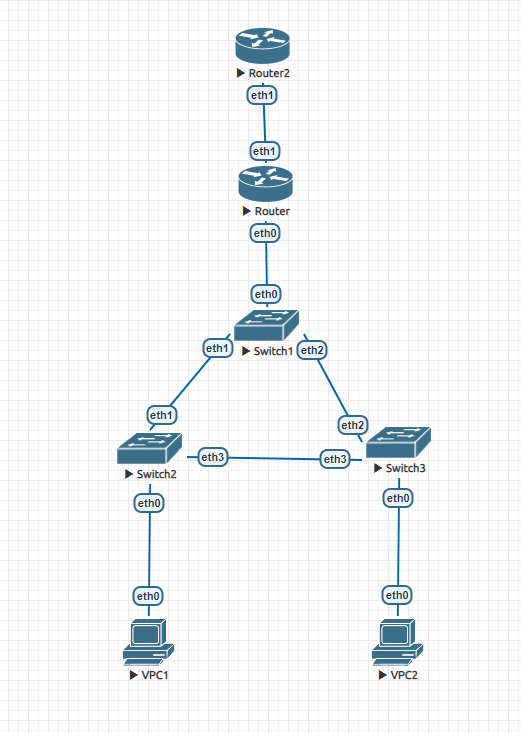

### Модернизация сети офиса из задания 1



### Router

```
 interfaces {
     ethernet eth0 {
         hw-id 50:00:00:01:00:00
         vif 10 {
             address 10.0.10.5/24
         }
         vif 20 {
             address 10.0.20.5/24
         }
     }
     ethernet eth1 {
         address 12.12.12.12/24
         hw-id 50:00:00:01:00:01
     }
     ethernet eth2 {
         hw-id 50:00:00:01:00:02
     }
     ethernet eth3 {
         hw-id 50:00:00:01:00:03
     }
     loopback lo {
     }
 }
 nat {
     source {
         rule 20 {
             outbound-interface eth1
             source {
             }
             translation {
                 address 12.12.12.12
             }
         }
     }
 }
 protocols {
     static {
         route 0.0.0.0/0 {
             next-hop 12.12.12.13 {
             }
         }
     }
 }
 service {
     dhcp-server {
         shared-network-name VLAN10 {
             subnet 10.0.10.0/24 {
                 default-router 10.0.10.5
                 name-server 10.0.10.5
                 range 0 {
                     start 10.0.10.10
                     stop 10.0.10.254
                 }
             }
         }
         shared-network-name VLAN20 {
             subnet 10.0.20.0/24 {
                 default-router 10.0.20.5
                 name-server 10.0.20.5
                 range 0 {
                     start 10.0.20.10
                     stop 10.0.20.254
                 }
             }
         }
     }
 }
 system {
     config-management {
         commit-revisions 100
     }
     conntrack {
         modules {
             ftp
             h323
             nfs
             pptp
             sip
             sqlnet
             tftp
         }
     }
     console {
         device ttyS0 {
             speed 115200
         }
     }
     host-name vyos
     login {
         user vyos {
             authentication {
                 encrypted-password $6$Geh/wadCOu4LCvAT$diIPyzS8J.BgNQN2.eW9JT42.7XVrugXPSETt7n7M0BJLrPsRRkxKfmbSxSk9lNiln3FULVrlneb5n6YSbg9R/
                 plaintext-password ""
             }
         }
     }
     ntp {
         server time1.vyos.net {
         }
         server time2.vyos.net {
         }
         server time3.vyos.net {
         }
     }
     syslog {
         global {
             facility all {
                 level info
             }
             facility protocols {
                 level debug
             }
         }
     }
 }
```

### Router2

```
 interfaces {
     ethernet eth0 {
         hw-id 50:00:00:07:00:00
     }
     ethernet eth1 {
         address 12.12.12.13/24
         hw-id 50:00:00:07:00:01
     }
     ethernet eth2 {
         hw-id 50:00:00:07:00:02
     }
     ethernet eth3 {
         hw-id 50:00:00:07:00:03
     }
     loopback lo {
     }
 }
 system {
     config-management {
         commit-revisions 100
     }
     conntrack {
         modules {
             ftp
             h323
             nfs
             pptp
             sip
             sqlnet
             tftp
         }
     }
     console {
         device ttyS0 {
             speed 115200
         }
     }
     host-name vyos
     login {
         user vyos {
             authentication {
                 encrypted-password $6$Geh/wadCOu4LCvAT$diIPyzS8J.BgNQN2.eW9JT42.7XVrugXPSETt7n7M0BJLrPsRRkxKfmbSxSk9lNiln3FULVrlneb5n6YSbg9R/
                 plaintext-password ""
             }
         }
     }
     ntp {
         server time1.vyos.net {
         }
         server time2.vyos.net {
         }
         server time3.vyos.net {
         }
     }
     syslog {
         global {
             facility all {
                 level info
             }
             facility protocols {
                 level debug
             }
         }
     }
 }
```

Как видно по настройкам Router, все клиенты получают сетевые настройки по DHCP,
при этом первые 10 адресов исключены (start с 10). NAT настроен согласно условию.


### VPC1

```
VPCS> ip dhcp
DDORA IP 10.0.10.10/24 GW 10.0.10.5
```

### VPC2

```
VPCS> ip dhcp
DDORA IP 10.0.20.10/24 GW 10.0.20.5
```

### VPC1 -> VPC2

```
VPCS> ping 10.0.20.10

84 bytes from 10.0.20.10 icmp_seq=1 ttl=63 time=44.068 ms
84 bytes from 10.0.20.10 icmp_seq=2 ttl=63 time=18.609 ms
84 bytes from 10.0.20.10 icmp_seq=3 ttl=63 time=22.331 ms
84 bytes from 10.0.20.10 icmp_seq=4 ttl=63 time=10.058 ms
84 bytes from 10.0.20.10 icmp_seq=5 ttl=63 time=56.432 ms
```

### VPC2 -> VPC1

```
VPCS> ping 10.0.10.10

84 bytes from 10.0.10.10 icmp_seq=1 ttl=63 time=105.579 ms
84 bytes from 10.0.10.10 icmp_seq=2 ttl=63 time=34.925 ms
84 bytes from 10.0.10.10 icmp_seq=3 ttl=63 time=26.453 ms
84 bytes from 10.0.10.10 icmp_seq=4 ttl=63 time=16.814 ms
84 bytes from 10.0.10.10 icmp_seq=5 ttl=63 time=24.346 ms
```

### VPC1 -> ext

```
VPCS> ping 12.12.12.13

84 bytes from 12.12.12.13 icmp_seq=1 ttl=63 time=19.822 ms
84 bytes from 12.12.12.13 icmp_seq=2 ttl=63 time=4.666 ms
84 bytes from 12.12.12.13 icmp_seq=3 ttl=63 time=9.153 ms
84 bytes from 12.12.12.13 icmp_seq=4 ttl=63 time=5.155 ms
84 bytes from 12.12.12.13 icmp_seq=5 ttl=63 time=8.776 ms
```

### VPC2 -> ext

```
VPCS> ping 12.12.12.13

84 bytes from 12.12.12.13 icmp_seq=1 ttl=63 time=4.464 ms
84 bytes from 12.12.12.13 icmp_seq=2 ttl=63 time=38.531 ms
84 bytes from 12.12.12.13 icmp_seq=3 ttl=63 time=8.319 ms
84 bytes from 12.12.12.13 icmp_seq=4 ttl=63 time=3.720 ms
84 bytes from 12.12.12.13 icmp_seq=5 ttl=63 time=5.951 ms
```

Нигде в настройках, кроме Router и Router2, нет никаких изменений в сравнении с первым дз.